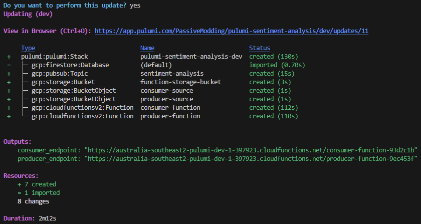

# Pulumi, Dotnet, GCP, Sentiment Analysis
## What is Pulumi?
Pulumi is an Infrastructure as Code (IaC) tool that allows you to define your infrastructure using code. Pulumi supports multiple languages and cloud providers. In this demo we will be using C# and Google Cloud Platform (GCP). Semantically it feels similar to Terraform, however it lets you use your favourite programming language to define your infrastructure. This allows you to leverage the full power of your programming language to define your infrastructure and avoid the limitations of a domain specific language.

Want to try the same deployment using Terraform? Check out my Terraform article [here](https://jaquesy.medium.com/build-a-serverless-sentiment-analysis-app-on-gcp-f184a8900855).

## What is Sentiment Analysis?
Sentiment analysis is the process of determining whether a piece of writing is positive, negative or neutral. In this deployment we will use the Google Cloud Natural Language API to perform sentiment analysis on a piece of text.

### Real-world use cases of Sentiment Analysis
- Brand monitoring: Sentiment analysis can be used to track what people are saying about a brand on social media. This can be used to identify and address negative sentiment and protect the brands reputation.
- Customer service: Sentiment analysis can be used to analyze customer service interactions such as chat logs or call transcripts to identify where service can be improved.
- Reviews and feedback: Sentiment analysis can be used to gather feedback from customers about products and services which can be used to improve designs or market products better.

## Overview


### Features
The application consists of several serverless components that interact with each other to provide a scalable and reliable architecture.

1. Producer Function: This acts as the entry point for new data, pushing it into the processing pipeline.
2. PubSub Queue: Data is queued here before being processed, ensuring a reliable and organized flow.
3. Consumer Function: Responsible for consuming data from the queue, utilizing the Google Cloud Natural Language API for sentiment analysis, and finally storing the processed data.
4. DataStore: The processed data finds its home here, providing a repository for easy retrieval and analysis.

Both the producer and consumer functions are deployed using Google Cloud Functions and written in dotnet 6 however Cloud Functions supports many [runtimes](https://cloud.google.com/functions/docs/concepts/exec#runtimes). The producer function is triggered by a http request and the consumer function is triggered by a pub/sub message. The producer function sends the message to a pub/sub topic. The consumer function reacts to the pub/sub message, forwarding it to the natural language API for sentiment analysis. After obtaining the sentiment score, the function sends results to datastore.

### Project Structure
By the end of this tutorial you should have the following project structure:
```bash
consumer
├── Function.cs
└── consumer.csproj
producer
├── Function.cs
└── producer.csproj
pulumi
├── Program.cs
├── Pulumi.dev.yaml
├── Pulumi.yaml
└── pulumi-sentiment-analysis.csproj
```

## Prerequisites
- [Google Cloud SDK](https://cloud.google.com/sdk/docs/install)
- [Pulumi](https://www.pulumi.com/docs/install/)
- [Dotnet 6.0](https://dotnet.microsoft.com/download)

## Setup and Deployment
Create a new project in GCP (or use an existing one), make sure you have IAM permissions to manage the resources we will create in this project.

Make sure your project is set in the gcloud cli
```bash
gcloud config set project <project-id>
```

Enable required apis [here](https://console.cloud.google.com/flows/enableapi?apiid=iam.googleapis.com,cloudresourcemanager.googleapis.com,pubsub.googleapis.com,eventarc.googleapis.com,cloudfunctions.googleapis.com,run.googleapis.com,cloudbuild.googleapis.com,language.googleapis.com,firestore.googleapis.com).

- [Pub/Sub API](https://console.cloud.google.com/apis/library/pubsub.googleapis.com) allows terraform to manage pub/sub topics.
    - [Eventarc API](https://console.cloud.google.com/apis/library/eventarc.googleapis.com) enables cloud function triggers from pub/sub topics.
- [Cloud Functions API](https://console.cloud.google.com/apis/library/cloudfunctions.googleapis.com) allows terraform to manage cloud functions.
    - [Cloud Run API](https://console.cloud.google.com/apis/library/run.googleapis.com) required as functions backend
    - [Cloud Build API](https://console.cloud.google.com/apis/library/cloudbuild.googleapis.com) required for cloud run
- [Firestore API](https://console.cloud.google.com/apis/library/firestore.googleapis.com) allows terraform to manage firestore databases.
    - [Datastore API](https://console.cloud.google.com/apis/library/datastore.googleapis.com) required for datastore mode
- [Natural Language API](https://console.cloud.google.com/apis/library/language.googleapis.com) allows the consumer function to call the natural language api.

Create the default datastore db
```bash
gcloud alpha firestore databases create --database="(default)" --location="<region>" --type="datastore-mode"
```
> Note: Multitenancy for datastore is currently in alpha and the dotnet client library lacks support for it as of writing, as such we will create and use the default datastore db outside of our Pulumi stack and import it into our stack rather than creating and deleting it as part of our stack.

Authorize the application default login so Pulumi can interact with GCP
```bash
gcloud auth application-default login
```

### Building the application
In this section we will write the code used for the Producer and Consumer functions. Want to skip straight to the Pulumi part? You can find the full source code of the project [here](https://github.com/PassiveModding/sentimental/tree/main/demos/pulumi-sentiment-analysis). Jump to the "Deploying the application" section to continue.

#### Install dotnet function templates
```bash
dotnet new install Google.Cloud.Functions.Templates
```
> Note: This is optional, alternatively you can simply create a `producer.csproj`/`consumer.csproj` and `Function.cs` file in each of the respective directories and copy the supplied code into those files

#### Producer function
Create a new dotnet http function project (in the project root directory)
```bash
dotnet new gcf-http -n producer
cd producer
dotnet add package Google.Cloud.PubSub.V1
```

Check your `producer/producer.csproj` and see if it matches the following:
```xml
<Project Sdk="Microsoft.NET.Sdk">
  <PropertyGroup>
    <OutputType>Exe</OutputType>
    <TargetFramework>net6.0</TargetFramework>
  </PropertyGroup>

  <ItemGroup>
    <PackageReference Include="Google.Cloud.Functions.Hosting" Version="2.1.0" />
    <None Include="appsettings*.json" CopyToOutputDirectory="PreserveNewest" />
    <PackageReference Include="Google.Cloud.PubSub.V1" Version="3.6.0" />
  </ItemGroup>
</Project>
```

In the `producer/Function.cs` file add the following code:
```csharp
using Google.Cloud.Functions.Framework;
using Google.Cloud.PubSub.V1;
using Grpc.Core;
using Microsoft.AspNetCore.Http;
using System;
using System.IO;
using System.Linq;
using System.Threading.Tasks;

namespace Producer;

public class Function : IHttpFunction
{
    public async Task HandleAsync(HttpContext context)
    {
        // read the message body
        using var reader = new StreamReader(context.Request.Body);
        var messageBody = await reader.ReadToEndAsync();

        // get our environment variables and configure the topic output
        var output_topic_id = Environment.GetEnvironmentVariable("OUTPUT_TOPIC_ID") ?? throw new Exception("OUTPUT_TOPIC_ID not set");
        var project_id = Environment.GetEnvironmentVariable("PROJECT_ID") ?? throw new Exception("PROJECT_ID not set");
        var topicName = new TopicName(project_id, output_topic_id.Split('/').Last());
        
        var emulatorHost = Environment.GetEnvironmentVariable("PUBSUB_EMULATOR_HOST");
        var publisherClient = emulatorHost == null ? PublisherClient.Create(topicName) : new PublisherClientBuilder
        {
            Endpoint = emulatorHost,
            ChannelCredentials = ChannelCredentials.Insecure,
            TopicName = topicName
        }.Build();

        // publish the message to the topic
        await publisherClient.PublishAsync(new PubsubMessage
        {
            Data = Google.Protobuf.ByteString.CopyFromUtf8(messageBody)
        });

        // return a success message with a 200 status code
        context.Response.StatusCode = StatusCodes.Status200OK;
        await context.Response.WriteAsync($"Message published to {topicName}: {messageBody}");
    }
}
```

You can check the full code [here](./producer/Function.cs).

#### Consumer function
Create a new dotnet event function project (in the project root directory)
```bash
dotnet new gcf-untyped-event -n consumer
cd consumer
dotnet add package Google.Apis.CloudNaturalLanguage.v1
dotnet add package Google.Cloud.Datastore.V1
dotnet add package Google.Cloud.Language.V1
dotnet add package Google.Cloud.PubSub.V1
dotnet add package Google.Events.Protobuf
```

Check your `consumer/consumer.csproj` and see if it matches the following:
```xml
<Project Sdk="Microsoft.NET.Sdk">
  <PropertyGroup>
    <OutputType>Exe</OutputType>
    <TargetFramework>net6.0</TargetFramework>
  </PropertyGroup>

  <ItemGroup>
    <PackageReference Include="Google.Apis.CloudNaturalLanguage.v1" Version="1.61.0.3130" />
    <PackageReference Include="Google.Cloud.Datastore.V1" Version="4.6.0" />
    <PackageReference Include="Google.Cloud.Functions.Hosting" Version="2.1.0" />
    <PackageReference Include="Google.Cloud.Language.V1" Version="3.3.0" />
    <PackageReference Include="Google.Cloud.PubSub.V1" Version="3.6.0" />
    <PackageReference Include="Google.Events.Protobuf" Version="1.3.0" />
    <None Include="appsettings*.json" CopyToOutputDirectory="PreserveNewest" />
  </ItemGroup>
</Project>
```

In the `consumer/Function.cs` file add the following code:
```csharp
using CloudNative.CloudEvents;
using Google.Cloud.Datastore.V1;
using Google.Cloud.Functions.Framework;
using Google.Cloud.Language.V1;
using Google.Events.Protobuf.Cloud.PubSub.V1;
using Grpc.Core;
using System;
using System.Threading;
using System.Threading.Tasks;

namespace Consumer;

public class Function : ICloudEventFunction<MessagePublishedData>
{
    public async Task HandleAsync(CloudEvent cloudEvent, MessagePublishedData data, CancellationToken cancellationToken)
    {
        // get our environment variables
        var projectId = Environment.GetEnvironmentVariable("PROJECT_ID") ?? throw new Exception("PROJECT_ID not set");

        // configure the datastore client
        var datastoreEmulatorHost = Environment.GetEnvironmentVariable("DATASTORE_EMULATOR_HOST"); 
        var db = datastoreEmulatorHost == null ? DatastoreDb.Create(projectId) : new DatastoreDbBuilder()
        {
            Endpoint = datastoreEmulatorHost,
            ChannelCredentials = ChannelCredentials.Insecure,
            ProjectId = projectId
        }.Build();

        // configure the language client
        var client = await LanguageServiceClient.CreateAsync(cancellationToken);

        var sentimentResult = await client.AnalyzeSentimentAsync(new Document()
        {
            // Get the text from the pubsub message
            Content = data.Message.TextData,
            Type = Document.Types.Type.PlainText
        }, cancellationToken);  

        // create a new entity to store in datastore
        var keyFactory = db.CreateKeyFactory("sentiment");
        Google.Cloud.Datastore.V1.Entity entity = new()
        {
            Key = keyFactory.CreateIncompleteKey(),
            ["created"] = DateTime.UtcNow,
            ["text"] = data.Message.TextData,
            ["score"] = sentimentResult.DocumentSentiment.Score,
            ["weight"] = sentimentResult.DocumentSentiment.Magnitude
        };

        // insert the entity into datastore
        using var transaction = await db.BeginTransactionAsync();
        transaction.Insert(entity);
        var commitResponse = await transaction.CommitAsync();

        Console.WriteLine($"Saved entity: {entity.Key}");
        Console.WriteLine($"Sentiment score: {sentimentResult.DocumentSentiment.Score}");
        Console.WriteLine($"Sentiment weight: {sentimentResult.DocumentSentiment.Magnitude}");
        Console.WriteLine($"Text: {data.Message.TextData}");
    }
}
```
Note the changes made to the template:
- The event function handler was changed to `ICloudEventFunction<MessagePublishedData>` so it can be triggered by a pub/sub message.
- `MessagePublishedData` was added as a parameter to the `HandleAsync` method so we can access the pub/sub message data.
- The `HandleAsync` method was made async so we can use await multiple async methods within the function.
- Using statements for the required client libraries.

You can check the full code [here](./consumer/Function.cs).

#### Locally testing the functions (optional)
Supplying a custom endpoint for Pub/Sub and Datastore via the `PUBSUB_EMULATOR_HOST` and `DATASTORE_EMULATOR_HOST` environment variables allows the functions to communicate with a custom endpoint rather than the real Pub/Sub and Datastore services. This allows us to test the functions locally without relying on services deployed to GCP.

Dockerfiles can specify the build steps for our functions so they can be run in containers. We can also setup emulators for Pub/Sub and DataStore using the `google/cloud-sdk:emulators` Docker image. Docker-compose can be used to specify the environment variables and simplify networking between all our dependencies.

For testing the functions locally you can find a guide [here](./testing-locally.md) along with all the source code used for this project.

### Deploying the application
Create a new Pulumi C# project from the project root directory
```bash
mkdir pulumi && cd pulumi
pulumi new gcp-csharp
```
> Note: Pulumi supports multiple different languages and cloud providers, see https://www.pulumi.com/docs/get-started/ for more information.

If it's your first time using Pulumi you'll be prompted to provide an access token to Pulumi cloud, follow the instructions to get a token and paste it into the terminal.

> Note: it is possible to set up a backend other than Pulumi cloud however that is outside the scope of this demo. Read more about Pulumi backends [here](https://www.pulumi.com/docs/concepts/state/).

Follow the prompts to create a new project, I used the following values:
```bash
project name: pulumi-sentiment-analysis
project description: A simple sentiment analysis application
stack name: dev
gcp:project: <your gcp project id>
```

### Let's take a look at the default project Pulumi created for us
```csharp
using Pulumi;
using Pulumi.Gcp.Storage;
using System.Collections.Generic;

return await Deployment.RunAsync(() =>
{
    // Create a GCP resource (Storage Bucket)
    var bucket = new Bucket("my-bucket", new BucketArgs
    {
        Location = "US"
    });

    // Export the DNS name of the bucket
    return new Dictionary<string, object?>
    {
        ["bucketName"] = bucket.Url
    };
});
```

We can get a basic overview of how Pulumi works by looking at this code.
Call `Deployment.RunAsync` to run our Pulumi deployment. Within the Function call define the resources to be created. In this case a storage bucket. We can see a new `Bucket` resource is created with `BucketArgs` specifying the properties used to configure the bucket. At the end of the function, return a dictionary of outputs we want to see when we run `pulumi up`. In this case we are returning the url of the bucket.

Let's remove the default resources and output from `Deployment.RunAsync` and start from scratch.

```csharp
using ...;

return await Deployment.RunAsync(() =>
{
  // Define Resources and logic here
});
```

## Define infrastructure components
All code blocks for the configuration can be placed within the `Deployment.RunAsync` anonymous function block. Since this runs sequentially it's good to think about the order in which we want to create our resources in order to satisfy any dependencies between them.

The components we will create are:
- Pub/Sub Topic
- Producer Function
- Consumer Function
- Storage Bucket
- Datastore Database (We already created this during project setup so we will import it into our stack rather than creating it as part of our stack)

Let's take a moment to think about the dependencies between these components.
- The pub/sub topic does not depend on any other resources to exist before it can be created.
- The storage bucket does not depend on any other resources to exist before it can be created.
- The datastore database does not depend on any other resources to exist before it can be created.
- The producer function depends on the pub/sub topic since it needs to know the topic name to publish messages to, it also needs access to the source code.
- The consumer function depends on the pub/sub topic to exist before it can be created since it needs to know the topic name to subscribe to, it also needs the source code.
- The function source code needs the storage bucket to exist before it can be uploaded to the bucket.

```csharp
using ...;

return await Deployment.RunAsync(() =>
{
    // configure inputs

    // define pub/sub topic
    // define storage bucket
    // import datastore database
    // upload producer source code to storage bucket
    // define producer function
    // upload consumer source code to storage bucket
    // define consumer function
    
    // return outputs
});
```

We can use this information to think about the order in which we should create our resources. We should create pub/sub topic and storage bucket first since they don't depend on any other resources. Then we can import the datastore database. Then we can upload the source code to the storage bucket. And lastly we can create the functions.

### Configuration
There are a few variables we will need to specify to configure our stack. 
We want to deploy some of our resources to a specific region so rather than hardcoding the region we will use the `Config` object to specify the region. We can access the region in our program using the `Config` object.

We already specified the project id when we created the Pulumi project so we can access it in our program using the `Config` object. If you go to the `Pulumi.dev.yaml` file in the `config` section you will see the project id is already specified. It has the prefix `gcp` because we specified the project id using the `gcp:project` flag when we created the Pulumi project. 
```csharp
using ...

return await Deployment.RunAsync(() =>
{
    // access values under the default prefix ie. pulumi-sentiment-analysis:region: <region>
    var config = new Config();
    var region = config.Require("region");
    // access values under the gcp prefix ie. gcp:project: <project_id>
    var gcpConfig = new Config("gcp");
    var projectId = gcpConfig.Require("project");
    ...
});
```

Pulumi will require these variables to be present when we call `pulumi up` and will throw an error if they are not present. You can take a look at the `Pulumi.dev.yaml` file in the `config` section to see the values we specified when we created the Pulumi project. We will address adding the region value to the `Pulumi.dev.yaml` file later.

### Infrastructure components
After setting up the configuration we can start defining our infrastructure components. Within the `Deployment.RunAsync` function we will define the resources we want to create. We will start by creating the pub/sub topic and storage bucket since they don't depend on any other resources.

### Pub/Sub
We don't have any additional args for the Pub/Sub topic so it's definition is pretty simple.
```csharp
var topic = new Topic("sentiment-analysis");
```

### Storage Bucket
```csharp
var bucket = new Bucket("function-storage-bucket", new BucketArgs
{
    Location = "US"
});
```

### Datastore
Since we created the datastore database outside of our Pulumi stack we will need to import it into our stack. 

Make sure to add `using Pulumi.Gcp.Firestore;` to the top of the file. There are multiple database offerings under the Gcp provider for things like BigTable or Spanner so we want to make sure we are using the `Firestore` database. 

Create a new `Database` resource and pass in the database id as the first argument. We will use the `DatabaseArgs` object to specify the properties we want to configure on the database. The location should be set to the region config value that we setup at the start.


Specify the type of the database as `DATASTORE_MODE` since Firestore will run in firestore mode by default. 

We will use the `CustomResourceOptions` object to specify the settings to import the database. We will set `RetainOnDelete` to true since we want it to exist outside of the Pulumi lifecycle. Set `ImportId` to `(default)` since that is the id of the database we created earlier.

```csharp
var dataStore = new Database("(default)", new DatabaseArgs
{
    LocationId = region,
    Type = "DATASTORE_MODE"
}, new CustomResourceOptions
{
    // deleting the default database will not succeed if it contains entities so we retain it
    RetainOnDelete = true,
    ImportId = "(default)"
});
```

### Producer Function
The producer function needs to reference it's source code from the storage bucket, we can do this by creating a new `BucketObject` resource to upload the source code to the bucket. The `BucketObject` resource requires the bucket name and the source code. 

Firstly let's create a zip file from the producer function source code. We will use the `ZipFile` class to create the zip file.

We will use the `FileAsset` class to reference the source code from the local file system. In order to keep things consistent and repeatable we will delete the zip file and the bin and obj directories before creating the zip file. 
```csharp
// Make sure we don't already have a zip files in the project root directory
if (File.Exists("../producer.zip"))
    File.Delete("../producer.zip");
// Delete the bin and obj directories so we don't zip them up
if (Directory.Exists("../producer/bin"))
    Directory.Delete("../producer/bin", true);
if (Directory.Exists("../producer/obj"))
    Directory.Delete("../producer/obj", true);
// Zip the producer function source code
// note, we use CompressionLevel.NoCompression sinze zipping with other methods can be non-deterministic
ZipFile.CreateFromDirectory("../producer", "../producer.zip", CompressionLevel.NoCompression, false); 
```
> Note: We will also use the `CompressionLevel.NoCompression` option to ensure the zip file has the same hash if the source code is the same. This is important since Pulumi will use the hash of the zip file to determine if the source code has changed and needs to be uploaded to the bucket.

Now that we have a zip file we can upload it to the bucket. We will use the `BucketObject` resource to upload the zip file to the bucket. The `BucketObject` resource requires the bucket name and the source code. We will use the `FileAsset` class to reference the source code from the local file system.
```csharp
// Upload the producer source code to the bucket
var producer_source = new BucketObject("producer-source", new BucketObjectArgs
{
    Bucket = bucket.Name,
    Source = new FileAsset("../producer.zip")
});   
```

Next we need create a new function resource.

Firstly add `using Pulumi.Gcp.CloudFunctionsV2;` to the top of the file, this will allow us to create a new function resource. `Function` is also in the `Pulumi.Gcp.CloudFunctions` namespace but we want to use the v2 version of the resource.

We will use the `Function` resource to create a new function. We will use the `FunctionArgs` object to specify the properties we want to configure on the function. We will use the `FunctionBuildConfigArgs` object to specify the build configuration for the function, namely the runtime, entrypoint and source code. 

The source code is provided using the `Source` property where the build config source args can be set to point to a gcp storage bucket. Using the `Bucket` and `BucketObject` we created earlier we can set the function to use the source code we uploaded to the bucket.

The producer function also requires the project id and the pub/sub topic id to be set as environment variables. We can use the `FunctionServiceConfigArgs` object to specify the environment variables. We will use the `InputMap<string>` object to specify the environment variables. The `InputMap<string>` object is a dictionary that allows us to specify the environment variables as key value pairs.
```csharp
var producer_function = new Function("producer-function", new FunctionArgs
{
    Location = region,
    BuildConfig = new FunctionBuildConfigArgs
    {
        Runtime = "dotnet6",
        EntryPoint = "Producer.Function",
        Source = new FunctionBuildConfigSourceArgs
        {
            StorageSource = new FunctionBuildConfigSourceStorageSourceArgs
            {
                Bucket = bucket.Name,
                Object = producer_source.Name
            }
        }
    },
    ServiceConfig = new FunctionServiceConfigArgs
    {
        EnvironmentVariables = new InputMap<string>
        {
            ["PROJECT_ID"] = projectId,
            ["OUTPUT_TOPIC_ID"] = topic.Id
        }
    }
});
```

Following the code we:
- Create a zip file from the producer function source code
- Upload the producer source code to the bucket
- Create a new function resource
- Configure the function to use the source code we just uploaded to the bucket.
    - Cloud Functions will automatically unzip the source code when it deploys the function
- Configure the function to use the pub/sub topic we created earlier by specifying the topic id as an environment variable

### Consumer Function
We will use the same approach to reference the consumer function source code from the storage bucket.

```csharp
if (File.Exists("../consumer.zip"))
    File.Delete("../consumer.zip");
if (Directory.Exists("../consumer/bin"))
    Directory.Delete("../consumer/bin", true);
if (Directory.Exists("../consumer/obj"))
    Directory.Delete("../consumer/obj", true);
ZipFile.CreateFromDirectory("../consumer", "../consumer.zip", CompressionLevel.NoCompression, false);

var consumer_source = new BucketObject("consumer-source", new BucketObjectArgs
{
    Bucket = bucket.Name,
    Source = new FileAsset("../consumer.zip")
});
```

Additionally we need to configure the consumer function to be triggered by a pub/sub message. We can do this by specifying the `EventTrigger` property.
```csharp
var consumer_function = new Function("consumer-function", new FunctionArgs
{
    Location = region,
    BuildConfig = new FunctionBuildConfigArgs
    {
        Runtime = "dotnet6",
        EntryPoint = "Consumer.Function",
        Source = new FunctionBuildConfigSourceArgs
        {
            StorageSource = new FunctionBuildConfigSourceStorageSourceArgs
            {
                Bucket = bucket.Name,
                Object = consumer_source.Name
            }
        }
    },
    ServiceConfig = new FunctionServiceConfigArgs
    {
        EnvironmentVariables = new InputMap<string>
        {
            ["PROJECT_ID"] = projectId
        }
    },
    EventTrigger = new FunctionEventTriggerArgs
    {
        EventType = "google.cloud.pubsub.topic.v1.messagePublished",
        PubsubTopic = topic.Id,
        TriggerRegion = region,
        RetryPolicy = "RETRY_POLICY_DO_NOT_RETRY"
    }
});
```
Note the use of `EventTrigger` to specify that the function should be triggered by a pub/sub message. This will configure a pub/sub subscription for for the function to receive messages from the topic.
There are plenty of other event triggers in addition to `messagePublished` supported by EventArc, you can see a list of all EventArc event types [here](https://cloud.google.com/eventarc/docs/reference/supported-events).

### Defining outputs
This is the last step in defining our infrastructure, we need to define the outputs we want to see when we run `pulumi up`. We will define the outputs for the producer and consumer endpoints.

```csharp
return new Dictionary<string, object?>
{
    ["producer_endpoint"] = producer_function.Url,
    ["consumer_endpoint"] = consumer_function.Url
};
```

### Let's take a look at the full code
[Program.cs](./pulumi/Program.cs)

> Note: We could take a more object oriented approach to this design and create classes to share common functionality between the producer and consumer functions. This would allow us to reduce the amount of code we need to write and make it easier to maintain. However for the purposes of this demo we will keep it in a single file.

## Deploying the stack
Try running `pulumi up` to deploy changes.

You'll notice because we added required config variables to our program, Pulumi will notify us that there is Missing required configuration.

Add the required configuration to your project.
```bash
pulumi config set pulumi-sentiment-analysis:region <region>
```

Notice how this is added to the `Pulumi.dev.yaml` file in the `config` section.

Run `pulumi up` again to deploy the changes.

> Alternatively try `pulumi preview --save-plan=plan.json` to save a plan then use `pulumi up --plan=plan.json` to deploy the plan. You can preview the output in the CLI or in the plan.json file. Read more about update plans [here](https://www.pulumi.com/docs/concepts/update-plans/)


Examine the details output before deploying to double check everything looks correct.


Notice how the name values of resources have a random suffix, this is to ensure the names are unique and allow multiple deployments of the same stack to exist in the same project. Pulumi will automatically generate a name based on the name we specified to Pulumi when creating the resource. 


You can override this behaviour by specifying a name explicitly in the args of the resource.


If you're happy with the changes, select `yes` to deploy the changes.


## Test the function
```bash
curl -H "Authorization: bearer $(gcloud auth print-identity-token)" --data 'My good review' <producer_endpoint>
```

You should see a response from the Producer function. Check datastore to see if the data was saved.
https://console.cloud.google.com/datastore/databases/-default-/entities;kind=sentiment 


## Make some changes to the application
In `producer/Function.cs` change the following line
```csharp
await context.Response.WriteAsync($"Message published to {topicName}: {messageBody}");
```
to
```csharp
await context.Response.WriteAsync($"[{DateTime.UtcNow}] Message published to {topicName}: {messageBody}");
```

## Redeploy the application
```bash
pulumi up
```

## Test the function again
```bash
curl -H "Authorization: bearer $(gcloud auth print-identity-token)" --data 'My good review' <producer_endpoint>
```
Notice the response from the producer function now includes a timestamp. You can also check datastore again to see if the data was saved.

## Clean Up
After completing this tutorial, you can delete everything that was created so that you don’t incur further costs.
```bash
pulumi down
```


### Delete the datastore database (optional)
In order to delete the database you will need to delete the entries added by our application. This can be done in the GCP console from the datastore page. Once all the entries have been deleted you can delete the database using the gcloud cli.
```bash
gcloud alpha firestore databases delete --database="(default)"
```

## Conclusion
In this tutorial, we built a sentiment analysis application using Pulumi. We used Pulumi to define our infrastructure as code and deploy it to GCP. We used Pulumi to create a pub/sub topic, storage bucket, datastore database and two cloud functions. We used the GCP console to see the results in datastore. We also used Pulumi to update the application and see the changes in action.

You can find the full source code for this tutorial at: 
https://github.com/PassiveModding/sentimental/

Try this deployment using Terraform: 
https://medium.com/@jaquesy/build-a-serverless-sentiment-analysis-app-on-gcp-f184a8900855

Thanks for reading this blog. Please feel free to reach out if you have any questions.

