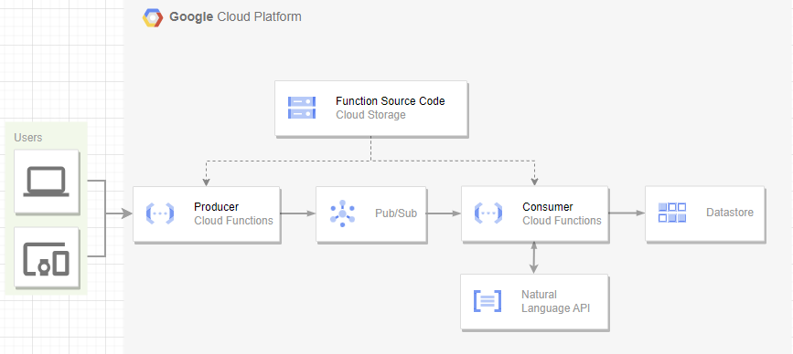

# Sentiment Analysis

## Description
Sentiment Analysis is a straightforward and efficient tool for analyzing the sentiment of text data using the Google Cloud Natural Language API. This application is designed to process input data through a series of steps, from data ingestion to sentiment analysis, and store the results for further analysis.

## Features
The application consists of several components that work seamlessly together to achieve sentiment analysis:
1. Producer Function: This acts as the entry point for new data, pushing it into the processing pipeline.
2. PubSub Queue: Data is queued here before being processed, ensuring a reliable and organized flow.
3. Consumer Function: Responsible for consuming data from the queue, utilizing the Google Cloud Natural Language API for sentiment analysis, and finally storing the processed data.
4. DataStore: The processed data finds its home here, providing a repository for easy retrieval and analysis.

Both the producer and consumer functions are deployed using Google Cloud Functions, offering a scalable and serverless architecture.



## Quickstart
### GCloud Configuration
You are required to create a GCP project then enable the Service Usage API, which allows terraform to handle necessary APIs for functioning. Various other APIs will be enabled by terraform for different roles. Navigate to the Datastore Settings to enable Datastore mode for Firestore/App Engine.

Create a GCP project and enable the following APIs:
- [Service Usage API](https://console.cloud.google.com/apis/library/serviceusage.googleapis.com) - allows terraform to manage APIs required to run the application.
- [Identity and Access Management (IAM) API](https://console.cloud.google.com/apis/library/iam.googleapis.com) - allows terraform to manage IAM roles and permissions.
- [Cloud Functions API](https://console.cloud.google.com/apis/library/cloudfunctions.googleapis.com) - Used to deploy the producer and consumer functions.
- [Cloud Pub/Sub API](https://console.cloud.google.com/apis/library/pubsub.googleapis.com) - Used to queue data for processing.
- [Cloud Datastore API](https://console.cloud.google.com/apis/library/datastore.googleapis.com) - Used to store processed data.
- [Cloud Storage](https://console.cloud.google.com/apis/library/storage-component.googleapis.com) - Used to store the cloud function source code.
- [Cloud Natural Language API](https://console.cloud.google.com/apis/library/language.googleapis.com) - Used to analyze the sentiment of text data.
- [Eventarc API](https://console.cloud.google.com/apis/library/eventarc.googleapis.com) - Used to trigger the consumer function on Pub/Sub events.
- [Cloud Resource Manager API](https://console.cloud.google.com/apis/library/cloudresourcemanager.googleapis.com)

Enable Datastore mode for Firestore/App Engine in the [Data store Settings](https://console.cloud.google.com/datastore/welcome)

### CI/CD Setup
The CI/CD pipeline is configured using Github Actions. The workflow is triggered on every push to the `main` branch.
The workflow is designed to deploy the required infrastructure and functions to GCP using terraform.

#### Terraform
Follow the outlined steps for the creation and management of required Google Cloud resources:

1. Create a bucket in your GCP project for backend purposes. This will be used to store the terraform state. Update the `main.tf` and fill in the bucket name in the `terraform` block.

2. Create a service account and obtain the JSON key file. Ensure that the service account has the required roles for creating and managing the resources you need.
- Note: For this deployment, the service account is using the following permissions:
    Editor
    Cloud Functions Admin - required for deploying the functions
    Pub/Sub Admin - required for creating the Pub/Sub topic and subscription
    Security Admin - required for creating service accounts for the functions
    Service Account Token Creator - required for impersonating the service account when running terraform locally

In your github repository, create a secret named `TFSTATE_SA_KEY` and paste the contents of the JSON key file. 
Additionally create variables for `PROJECT_ID` and `REGION` and fill in the values.

#### Cloud Functions
1. Run `terraform init` to initialize the terraform backend.
2. Run `terraform plan` to see the changes that will be made.
3. Run `terraform apply` to create the necessary resources.
Note: The CI/CD pipeline will automatically run these steps on pushes to the `main` branch. But you can also run them manually.
When running locally, you should impersonate the service account to ensure that the correct permissions are used.
```bash
export GOOGLE_CREDENTIALS=$(cat <credentials.json file> | tr -s '\n' ' ')
```

### Cloud Testing
To test the cloud deployment, send a POST request to the producer function with the following bodies:
```bash
curl -H "Authorization: bearer $(gcloud auth print-identity-token)" $(terraform output -raw producer_endpoint) --data 'My good review'
```
Check cloud datastore to see the results.
https://console.cloud.google.com/datastore/databases/-default-/entities;kind=Sentiment


### Local Development Environment
Setting up a functional local deployment environment is streamlined for developers. Utilizing Google's emulator for PubSub and Datastore, you can easily emulate the deployment. 
To start the producer and consumer functions, execute the following command:
```bash
docker compose -f docker-compose-local.yml build
docker compose -f docker-compose-local.yml up
```

Create the required Pub/Sub topic and subscription:
```bash
curl -X PUT "http://localhost:8085/v1/projects/sentimental-analysis/topics/sentimental-analysis"
curl -X PUT "http://localhost:8085/v1/projects/sentimental-analysis/subscriptions/sentimental-analysis-subscription" -H "Content-Type: application/json" --data '{"topic":"projects/sentimental-analysis/topics/sentimental-analysis","pushConfig":{"pushEndpoint":"http://consumer-app:8080"}}'
```

Try testing the producer function by sending a POST request to `http://localhost:8086` with the following bodies:
```bash
curl -X POST -d 'hello world' localhost:8086
curl -X POST -d 'hello good world' localhost:8086
curl -X POST -d 'hello bad world' localhost:8086
```
Observe the results in the console or in the Datastore emulator. 
You should see the sentiment score for each text.
Note: When using the emulator, we mock the sentiment analysis so if `good` is in the text, the score will be 1, and if `bad` is in the text, the score will be -1 and if neither is in the text, the score will be 0.

### Questions
1. Why were Google Cloud Functions chosen as the compute platform? 
    - Tailored for event-driven applications
    - The functions are stateless and do not require a server to be running at all times
    - Compared to Cloud Run the functions are simple enough that the extra complexity of Cloud Run is not needed

2. What factors influenced the choice of Google Cloud Pub/Sub for message passing between functions? 
    - Acts as a buffer between the producer and consumer functions preventing spikes in traffic
    - Fault tolerance by allowing for retries if the consumer function fails

3. How does the use of Terraform improve the management of infrastructure? 
    - Versioning of infrastructure, allowing for easy rollback
    - Infrastructure as code makes it easy to reuse, keep predictable and consistent
    - Easy to deploy and destroy infrastructure

4. What security measures have been implemented to protect the application and its data? 
    - Both the producer and consumer are deployed using service accounts with the least privilege principle
    - The producer function only has permission to post to the Pub/Sub topic
    - The consumer function only has permission to insert into Datastore
    - The terraform backend is secured using a service account key stored as a GitHub secret

5. How does the GitHub workflow help automate the deployment process and reduce the risk of human error? 
    - It creates a consistent and predictable deployment process
    - Using secrets, it allows for secure deployment of infrastructure

6. Are there any scalability considerations for the application's architecture? 
    - Pub/Sub Scaling - Pub/Sub scales automatically to meet the demands of the application
    - Cloud Functions Scaling - Cloud Functions scales automatically to meet the demands of the application, functions v2 allows for concurrency reducing the cold start time
    - Datastore Scaling - Datastore scales automatically to meet the demands of the application

7. Why was datastore chosen as the database for storing sentiment analysis results? 
    - It is a NoSQL database that is highly scalable and reliable
    - It is a managed service that does not require any maintenance
    - Its schemaless nature allows for flexibility in the data model meaning changes can be made without downtime

8. What trade-offs were made in the choice of programming languages and libraries?
    - C# has client libraries for all the required Google Cloud services
    - It is a compiled language that is fast and efficient

