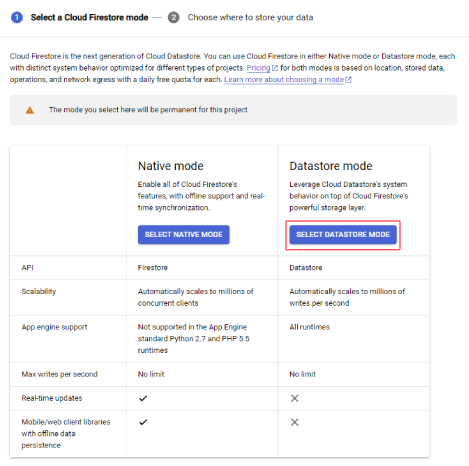
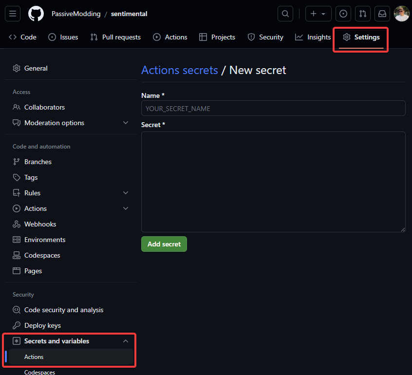
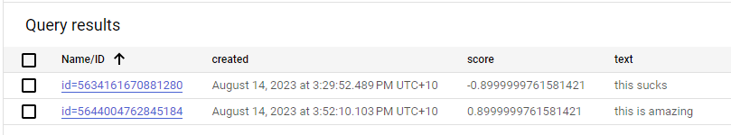

# Sentiment Analysis

## Description
Sentiment Analysis is a straightforward and efficient tool for analyzing the sentiment of text data using the Google Cloud Natural Language API. This application is designed to process input data through a series of steps, from data ingestion to sentiment analysis, and store the results for further analysis.

## Features
The application consists of several components that work seamlessly together to achieve sentiment analysis:
1. Producer Function: This acts as the entry point for new data, pushing it into the processing pipeline.
2. PubSub Queue: Data is queued here before being processed, ensuring a reliable and organized flow.
3. Consumer Function: Responsible for consuming data from the queue, utilizing the Google Cloud Natural Language API for sentiment analysis, and finally storing the processed data.
4. DataStore: The processed data finds its home here, providing a repository for easy retrieval and analysis.

Both the producer and consumer functions are deployed using Google Cloud Functions, offering a scalable and serverless architecture.


## Quickstart
### Prerequisites

#### Tools

Required tools for deployment:
- [Google Cloud SDK](https://cloud.google.com/sdk/docs/install)

Required tools for local development:
- [Terraform](https://learn.hashicorp.com/tutorials/terraform/install-cli)
- [Docker](https://docs.docker.com/get-docker/)
- [Docker Compose](https://docs.docker.com/compose/install/)
- [Dotnet 6.0 SDK](https://dotnet.microsoft.com/en-us/download/dotnet/6.0) (Optional[^dotnet-optional-footnote])

[^dotnet-optional-footnote]: Only required if you want to make changes to the producer and consumer functions and test them locally. The dockerfiles are configured to build the functions already.

#### Create a project
(Optional, you can make use of an existing project)
```bash
gcloud projects create sentimental-analysis
gcloud config set project sentimental-analysis
```

Set the environment variable for the project id and region [^project-id-region-footnote]
[^project-id-region-footnote]: Note that exporting the variables will only be available for the current shell session. If you restart your shell, you will need to export them again.
```bash
export PROJECT_ID=$(gcloud config get-value project)
export REGION=australia-southeast2
```

#### Enable GCP APIs

The following APIs are required for this deployment:
- [Identity and Access Management (IAM) API](https://console.cloud.google.com/apis/library/iam.googleapis.com)  allows terraform to manage IAM roles and permissions.
- [Cloud Resource Manager API](https://console.cloud.google.com/apis/library/cloudresourcemanager.googleapis.com) allows terraform to manage your project.
- [Pub/Sub API](https://console.cloud.google.com/apis/library/pubsub.googleapis.com) allows terraform to manage pub/sub topics.
    - [Eventarc API](https://console.cloud.google.com/apis/library/eventarc.googleapis.com) enables cloud function triggers from pub/sub topics.
- [Cloud Functions API](https://console.cloud.google.com/apis/library/cloudfunctions.googleapis.com) allows terraform to manage cloud functions.
    - [Cloud Run API](https://console.cloud.google.com/apis/library/run.googleapis.com) required as functions backend
    - [Cloud Build API](https://console.cloud.google.com/apis/library/cloudbuild.googleapis.com) required for cloud run

The following command will enable these APIs:
```bash
gcloud services enable iam.googleapis.com cloudresourcemanager.googleapis.com pubsub.googleapis.com eventarc.googleapis.com cloudfunctions.googleapis.com run.googleapis.com cloudbuild.googleapis.com
```

Note: some of these apis require billing to be enabled. [^billing-footnote]
[^billing-footnote]: If you have not already enabled billing for your project, you can do so by running the following command: `gcloud beta billing projects link $PROJECT_ID --billing-account=<billing-account-id>`

#### Enable Datastore mode for Firestore/App Engine

This is a manual step that needs to be done in the GCP console.[^datastore-mode-footnote]
[^datastore-mode-footnote]: Datastore mode is required for the consumer function to be able to write to Datastore. If you do not enable this, you will get an error when the consumer function tries to write to Datastore. You can only have one mode in a project, so if you already have Firestore mode enabled in your project already it may be better to create a new project for this deployment. You can read more about it here: [Datastore Mode](https://cloud.google.com/datastore/docs/firestore-or-datastore#datastore_mode)
 - [Data store Settings](https://console.cloud.google.com/datastore/welcome)



#### Terraform

Follow the outlined steps for the creation and management of required Google Cloud resources:

1. Create a bucket in your GCP project for backend purposes.[^backend-bucket-footnote]

[^backend-bucket-footnote]: The backend bucket is used to store the terraform state file. This is required for terraform to manage the infrastructure. You can read more about it here: [Terraform Backend](https://www.terraform.io/docs/language/settings/backends/gcs.html). You can re-use an existing bucket but ensure that the service account you use has the required permissions to read and write to the bucket.

```bash
gsutil mb gs://<bucket-name>
```

2. Update the `backend.tf` and fill in the bucket name in the `terraform` block.
```terraform
terraform {
  backend "gcs" {
    # must be pre-created
    bucket = "<bucket-name>"
  }
}
```

3. Create a service account for terraform to use and give it the required permissions.

```bash
gcloud iam service-accounts create terraform-admin --display-name "Terraform admin account"
```

```bash
gcloud projects add-iam-policy-binding $PROJECT_ID --member serviceAccount:terraform-admin@$PROJECT_ID.iam.gserviceaccount.com --role roles/owner
```
Note: The `roles/owner` role is used for simplicity, but it will be more secure to create a custom role with the required permissions. For this deployment, the service account is using the following permissions:
- Cloud Functions Admin - function deployment
- Eventarc Viewer - function event trigger requirement
- Pub/Sub Admin - Pub/Sub topic and subscription
- Role Administrator - Custom roles for the functions
- Service Account Admin - Create and set policies for service accounts
- Storage Admin - create and manage storage buckets

4. Create a JSON key file for the service account and download it.[^sa-key-footnote]
[^sa-key-footnote]: The JSON key file is used to authenticate terraform with GCP. There are other ways to authenticate which may be more secure, but this is the simplest way. You can read more about it here: [Terraform Authentication](https://registry.terraform.io/providers/hashicorp/google/latest/docs/guides/provider_reference#authentication). DO NOT COMMIT THIS FILE TO SOURCE CONTROL. It is recommended to store it as a GitHub secret.

```bash
gcloud iam service-accounts keys create terraform-admin-key.json --iam-account terraform-admin@$PROJECT_ID.iam.gserviceaccount.com
```

#### Github
In your github repository, create a secret named `TFSTATE_SA_KEY` and paste the contents of the JSON key file. 
Additionally create variables for `PROJECT_ID` and `REGION` and fill in the values. [^github-variables-footnote]
[^github-variables-footnote]: Variables are separate from secrets and are used to store values that are not sensitive. 



### CI/CD Deployment
When a commit is pushed to the `main` branch, the CI/CD pipeline will be triggered and the following steps will be executed:
1. Terraform Init - Initialize the terraform backend
2. Terraform Format - Ensure the terraform files are formatted correctly
3. Terraform Plan - Create a plan for the infrastructure deployment
4. Terraform Apply - Apply the plan and deploy the infrastructure

As part of the terraform plan/appy steps the function source code is ziped and uploaded to a storage bucket. The function is then deployed using the zip file. 

Note: You can manually trigger the workflow by going to the actions tab in your repository and clicking on the `Deploy` workflow.

### Testing the deployment
To test the cloud deployment, send a POST request to the producer function with the following bodies:
```bash
curl -H "Authorization: bearer $(gcloud auth print-identity-token)" $(terraform output -raw producer_endpoint) --data 'My good review'
```
Note: you will need to have run `terraform init` to link to your backend locally otherwise you will not have access to `terraform output`. Otherwise you can view the endpoint in the GCP console or the output of github actions.

Check cloud datastore to see the results.
https://console.cloud.google.com/datastore/databases/-default-/entities;kind=Sentiment



### Deploying terraform from local machine
Set the environment variable for the project id and region
```bash
cd terraform
cp terraform.auto.tfvars.example terraform.auto.tfvars
sed -i "s/your-project-id/$PROJECT_ID/g" terraform.auto.tfvars
sed -i "s/your-region/$REGION/g" terraform.auto.tfvars
terraform fmt
cat terraform.auto.tfvars
```

Give yourself permission to impersonate the service account
```bash
gcloud iam service-accounts add-iam-policy-binding terraform-admin@$PROJECT_ID.iam.gserviceaccount.com --member user:$(gcloud config get-value account) --role roles/iam.serviceAccountTokenCreator
```

Set the environment variable for the service account, terraform will use this to authenticate with GCP[^sa-impersonation-gcp-footnote] 

[^sa-impersonation-gcp-footnote]: GCP Service Account Impersonation in Terraform - https://cloud.google.com/blog/topics/developers-practitioners/using-google-cloud-service-account-impersonation-your-terraform-code
```bash
export GOOGLE_IMPERSONATE_SERVICE_ACCOUNT=terraform-admin@$PROJECT_ID.iam.gserviceaccount.com
```

```bash
terraform init
terraform plan --out tfplan
terraform apply tfplan
```


### Local Development Environment
Setting up a functional local deployment environment is streamlined for developers. Utilizing Google's emulator for PubSub and Datastore, you can easily emulate the deployment. 
To start the producer and consumer functions, execute the following command:
```bash
docker compose up --build
```

Create the required Pub/Sub topic and subscription:
```bash
curl -X PUT "http://localhost:8085/v1/projects/sentimental-analysis/topics/sentimental-analysis"
curl -X PUT "http://localhost:8085/v1/projects/sentimental-analysis/subscriptions/sentimental-analysis-subscription" -H "Content-Type: application/json" --data '{"topic":"projects/sentimental-analysis/topics/sentimental-analysis","pushConfig":{"pushEndpoint":"http://consumer-app:8080"}}'
```

Try testing the producer function by sending a POST request to `http://localhost:8086` with the following bodies:
```bash
curl -X POST -d 'hello world' localhost:8086
curl -X POST -d 'hello good world' localhost:8086
curl -X POST -d 'hello bad world' localhost:8086
```
Observe the results in the console or in the Datastore emulator. 
You should see the sentiment score for each text.
Note: When using the emulator, we mock the sentiment analysis so if `good` is in the text, the score will be 1, and if `bad` is in the text, the score will be -1 and if neither is in the text, the score will be 0.

## Data Flow
The producer function is triggered by an HTTP request. The function then publishes the data to a Pub/Sub topic. The consumer function is triggered by a Pub/Sub event and consumes the data from the topic. The consumer function then uses the Google Cloud Natural Language API to analyze the sentiment of the text data. The results are then stored in Datastore.

## Infrastructure
The infrastructure is managed using Terraform. The following resources are created:
- Cloud Functions
    - Producer Function - HTTP Function
    - Consumer Function - Pub/Sub Function
- Cloud Pub/Sub
    - Topic - used to queue data for processing
    - Subscription - used to trigger the consumer function
- Cloud Datastore
    - Entity - used to store the sentiment analysis results
- Cloud Storage
    - Bucket - used to store the function source code

### Security
The following security measures have been implemented:
- Least privilege principle - the producer and consumer functions are deployed using service accounts with the least privilege principle
- Terraform backend - the terraform backend is secured using a service account key stored as a GitHub secret
- GitHub workflow - the GitHub workflow is used to automate the deployment process and reduce the risk of human error
- Cloud Functions - the functions are deployed using a CI/CD pipeline, so the source code is versioned in GitHub

### Scalability
The following scalability considerations have been made:
- Pub/Sub Scaling - Pub/Sub acts as a buffer between the producer and consumer functions preventing spikes in traffic from stressing the consumer function
- Cloud Functions Scaling - Cloud Functions scales automatically to meet the demands of the application, functions v2 allows for concurrency reducing the cold start time
- Datastore Scaling - Datastore scales automatically to meet the demands of the application
- Use of managed services means there is less manual work required to scale the application

### Datastore
Datastore is used to store the sentiment analysis results. It is a NoSQL database that is highly scalable and reliable. It is a managed service that does not require any maintenance. Its schemaless nature allows for flexibility in the data model meaning changes can be made without downtime.

### Cloud Functions
Cloud Functions are used to deploy the producer and consumer functions. They are serverless and scale automatically to meet the demands of the application. They are deployed using a CI/CD pipeline, so the source code is versioned in GitHub. The functions are stateless and do not require a server to be running at all times. Compared to Cloud Run the functions are simple enough that the extra complexity of Cloud Run is not needed [^cloud-run-footnote] 

[^cloud-run-footnote]: Cloud Functions uses Cloud Run in the backend, so it is still using the same technology. Cloud Run is more suited for containerized applications that require more control over the environment. Cloud Functions is more suited for simple functions that are triggered by events.

### Cloud Pub/Sub
Cloud Pub/Sub is used to queue data for processing. It acts as a buffer between the producer and consumer functions preventing spikes in traffic from stressing the consumer function. It also provides fault tolerance by allowing for retries if the consumer function fails [^pubsub-retries-footnote]

[^pubsub-retries-footnote]: Pub/Sub has a retry policy that allows for retries if the consumer function fails. This is useful if the consumer function fails due to a temporary error but is able to process the message successfully on a retry. This is not possible with direct function to function communication. Dead letter queues can also be used to store messages that fail to be processed after a certain number of retries but are not used in this deployment for simplicity.

## Questions

1. How does the use of Terraform improve the management of infrastructure? 
    - Versioning of infrastructure, allowing for easy rollback
    - Infrastructure as code makes it easy to reuse, keep predictable and consistent
    - Easy to deploy and destroy infrastructure

2. How do I version the functions if the published version is immutable?
    - The functions are deployed using a CI/CD pipeline, so the source code is versioned in GitHub
    - Separate the git repository into multiple branches, only merging to the main branch when the code is ready to be deployed
        - Further you can have separate branches for development, staging and production 

3. What purpose does running local emulators serve?
    - Allows for easy local development and testing
    - Allows for easy debugging
    - Allows for easy integration testing

4. Why use docker/docker-compose for local development instead of running the functions directly?
    - Dependencies are managed in the dockerfile meaning conflicts are less likely
    - The environment is consistent across all developers
    - Easy to deploy and destroy